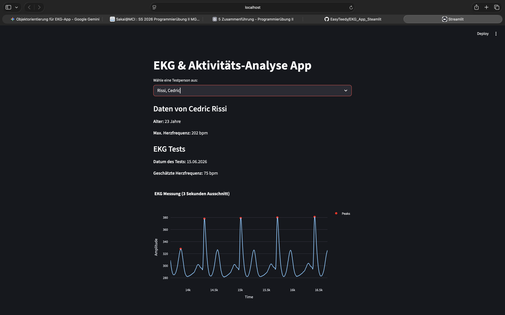

# EKG & Aktivitaets-Analyse App

Diese Streamlit-Anwendung dient der interaktiven Analyse und Visualisierung von EKG-Daten. Das Projekt wurde vollstaendig objektorientiert umgesetzt. Personen- und EKG-Daten werden in eigenen Python-Klassen (Person und Ekgdata) strukturiert verwaltet, um eine automatische Peak-Erkennung durchzufuehren und die Herzfrequenz zu berechnen.

## Projekt herunterladen und starten (PDM)

Dieses Projekt nutzt PDM zur Verwaltung der Abhaengigkeiten und der virtuellen Umgebung. Um die App lokal auf deinem System auszufuehren, muessen folgende Schritte im Terminal durchgefuehrt werden:

1. Das Repository von GitHub klonen und in den Projektordner wechseln:
   ```bash
   git clone [https://github.com/marvenotto/EKG_App_Objektorientierung.git](https://github.com/marvenotto/EKG_App_Objektorientierung.git)
   cd EKG_App_Objektorientierung
   ```

2. Virtuelle Umgebung einrichten und benoetigte Pakete installieren:
   ```bash
   pdm install
   ```

3. Die Streamlit-App starten:
   ```bash
   pdm run streamlit run main.py
   ```

Nach der Eingabe des Startbefehls oeffnet sich das Dashboard automatisch im Webbrowser

## Autoren

* **Cedric Rissi**
* **Marven Otto**

## Screenshot der App

