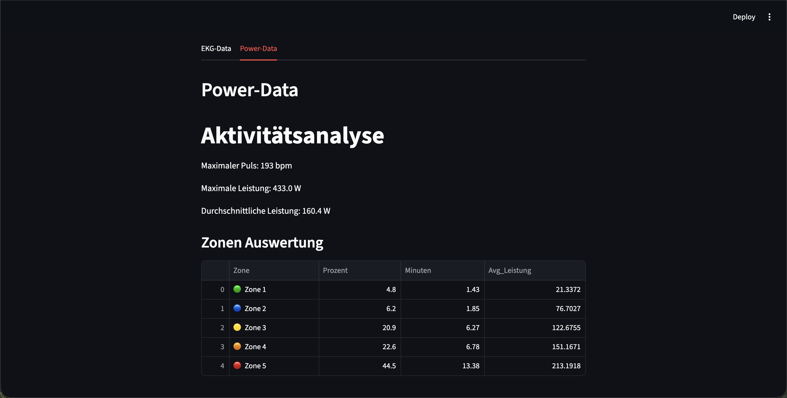
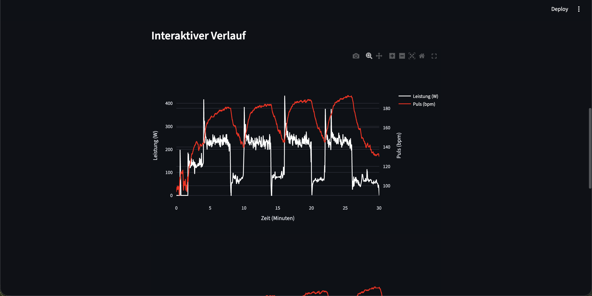
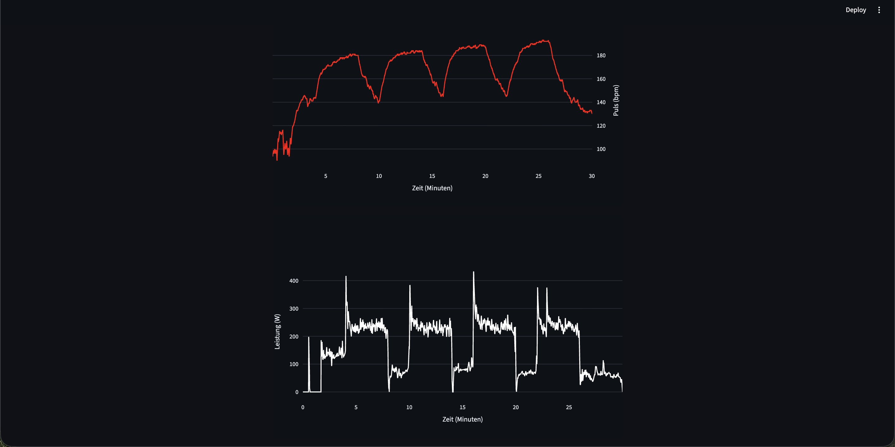

# 📊 EKG & Aktivitäts-Analyse App

Eine interaktive **Streamlit-Anwendung** zur Analyse und Visualisierung von Fitness- und EKG-Daten. Die App berechnet detaillierte Leistungsstatistiken, teilt Aktivitäten in 5 Belastungszonen ein und präsentiert die Daten mit interaktiven Plotly-Diagrammen.

---

## ✨ Features

- 👤 **Versuchspersonenverwaltung** – Wähle aus mehreren Testpersonen aus
- 📈 **EKG-Datenanalyse** – Visualisierung von Herzfrequenzdaten über die Zeit
- 💪 **Leistungsdatenanalyse** – Detaillierte Leistungsstatistiken und -zonen
- 🎯 **Dynamische Belastungszonen** – 5 Herzfrequenzzonen basierend auf maximaler Herzfrequenz
- 📊 **Interaktive Visualisierung** – Plotly-Diagramme zum Erforschen der Daten
- 🖼️ **Personenfotos** – Anzeige von Profilbildern
---

## 🚀 Schnellstart

### Voraussetzungen
- Python 3.13 oder höher
- **PDM** – [Installation](https://pdm-project.org/latest/#installation)

### Installation & Ausführung

1. **Repository klonen und in das Verzeichnis wechseln:**
   ```bash
   git clone <repository-url>
   cd EKG_App_Steamlit
   ```

2. **Abhängigkeiten mit PDM installieren:**
   ```bash
   pdm install
   ```

3. **App starten:**
   ```bash
   pdm run streamlit run main.py
   ```

4. **Browser öffnen:**
   ```
   Local URL: http://localhost:8501
   Network URL: http://10.55.15.193:8501
   ```

> **💡 Tipp:** VSCode kann beim ersten Start der App kurz langsam sein – einfach ein paar Sekunden Geduld haben fals nichts passiert, einfach stoppen mit ^c und erneut pdm run streamlit run main.py ausführen! 

---

## 📁 Projektstruktur

```
EKG_App_Steamlit/
├── main.py                 # Hauptanwendung
├── pyproject.toml          # PDM Projektdatei
├── README.md               # Diese Datei
├── data/
│   ├── person_db.json      # Personendatensätze
│   ├── activities/
│   │   └── activity.csv    # Aktivitätsdaten
│   ├── ekg_data/
│   │   ├── 01_Ruhe.txt     # EKG Ruhemessungen
│   │   ├── 02_Ruhe.txt
│   │   ├── 03_Ruhe.txt
│   │   ├── 04_Belastung.txt # EKG Belastungsmessungen
│   │   ├── 05_Belastung.txt
│   │   └── ReadMe.txt
│   └── pictures/           # Profilbilder der Versuchspersonen
└── source/
    ├── read_data.py        # Datenlese-Funktionen
    ├── read_pandas.py      # Pandas und Plotly Funktionen
    └── my_first_pandas.py  # Zusätzliche Pandas-Tools
```

---

## 📋 Anforderungen

| Paket | Version | Zweck |
|-------|---------|-------|
| `streamlit` | ≥1.57.0 | Web-Framework für die UI |
| `pandas` | ≥3.0.3 | Datenverwaltung und -analyse |
| `numpy` | ≥2.4.4 | Numerische Berechnungen |
| `plotly-express` | ≥0.4.1 | Interaktive Datenvisualisierung |

---

## 💻 Verwendung

### Daten anzeigen
1. Wähle eine **Versuchsperson** aus dem Dropdown-Menü
2. Klicke auf **"Daten anzeigen"**
3. Die Personeninformationen und das Foto werden angezeigt

### Reiter
- **EKG-Data** – Visualisierung der Herzfrequenzmessungen
- **Power-Data** – Leistungsstatistiken und Belastungszonen

---

## 🏋️ Die 5 Belastungszonen erklärt

Die App teilt die Herzfrequenz automatisch in **5 Trainings- und Belastungszonen** ein. Diese Zonen basieren auf der **maximalen Herzfrequenz (HFmax)** der ausgewählten Person.

### 🟢 Zone 1: SEHR LEICHT (50–60% HFmax)

**Wie fühlt es sich an?**
Es fühlt sich sehr leicht an. Du könntest stundenlang weitermachen.

**Trainingseffekt:**
- Förderung von Erholung und Gesundheit
- Vorbereitung für intensivere Trainingseinheiten
- Ideal zum Warmlaufen und Erholen

---

### 🔵 Zone 2: LEICHT (60–70% HFmax)

**Wie fühlt es sich an?**
Es fühlt sich immer noch angenehm und einfach an. Du könntest stundenlang weitermachen.

**Trainingseffekt:**
- Verbesserung der allgemeinen Ausdauer
- Optimierung des Fettstoffwechsels und der muskulären Fitness
- Erhöhung der Kapillardichte
- Wesentlicher Bestandteil jedes Trainingsprogramms

---

### 🟡 Zone 3: MODERAT (70–80% HFmax)

**Wie fühlt es sich an?**
Du fängst an tiefer zu atmen und fühlst eine mäßige Anstrengung.

**Trainingseffekt:**
- Besonders effektiv zur Verbesserung der Blutzirkulation
- Verbesserung der aeroben Fitness
- Laktat beginnt sich anzureichern, wird aber noch als Energie verwertet
- Erhöhung der Trainings-Effizienz

---

### 🟠 Zone 4: HART (80–90% HFmax)

**Wie fühlt es sich an?**
Deine Muskeln fühlen sich müde an und du atmest schwer.

**Trainingseffekt:**
- Verbesserung der Geschwindigkeitsausdauer
- Bessere Nutzung von Kohlenhydraten als Energiequelle
- Verbesserte Laktattoleranz im Blut
- Intensive Belastung für kürzere Zeiträume

---

### 🔴 Zone 5: SEHR HART (90–100% HFmax)

**Wie fühlt es sich an?**
Es fühlt sich für Muskeln und Atmung erschöpfend an.

**Trainingseffekt:**
- Maximale Anstrengung und maximale Kapazität des Cardiovaskulären-Systems
- Hohe Laktat-Ansammlung im Blut
- Nur für kurze Zeiträume möglich (einige Minuten)
- Ideal für Sprinttraining und maximale Leistungssteigerung

---

### 📊 Zusammenfassung der Zonen

| Zone | Intensität | Gefühl | Beste Nutzung |
|------|-----------|--------|---------------|
| **1** | Sehr Leicht | Sehr entspannt | Regeneration & Warmlaufen |
| **2** | Leicht | Angenehm | Ausdauertraining |
| **3** | Moderat | Mäßig anstrengend | Aerobe Fitness |
| **4** | Hart | Anstrengend | Geschwindigkeitsausdauer |
| **5** | Sehr Hart | Erschöpfend | Sprinttraining (kurz) |

### 📍 Wo finde ich die Zonen in der App?

- Gehe zum Reiter **"Power-Data"**
- Das Diagramm zeigt die **zeitliche Verteilung** der Herzfrequenz auf alle 5 Zonen
- Farbcodierung (🟢→🔴) macht die Intensität auf einen Blick sichtbar
- **Tabelle "Zonen Auswertung"** zeigt, wie viel Zeit und durchschnittliche Leistung pro Zone

### 💡 Beispiel-Interpretation

**Ruhe-Messung:**
- 🟢🔵 Hauptsächlich in Zone 1–2 (50–70% HFmax, normale Ruheherzfrequenz)

**Belastungs-Messung:**
- 🟡🟠🔴 Verteilung über mehrere Zonen, mit deutlichen Spitzen in Zone 3–5 (intensives Training, höhere Belastung)

---

## 👨‍💻 Autor

**Cedric Rissi**
**Marven Otto**  
---

## 🐛 Feedback & Support

Hast du Fragen oder Probleme? Erstelle gerne ein Issue im Repository oder kontaktiere den Autor direkt.

## Screenshots from Webinterface:


